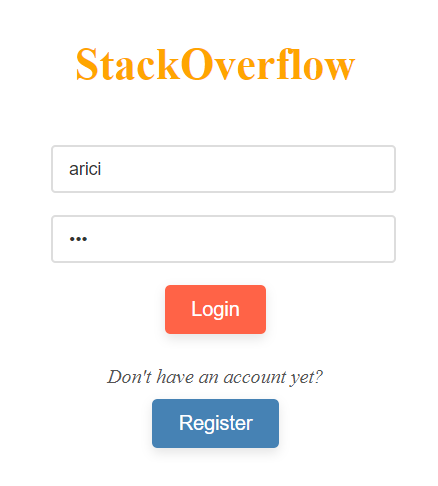
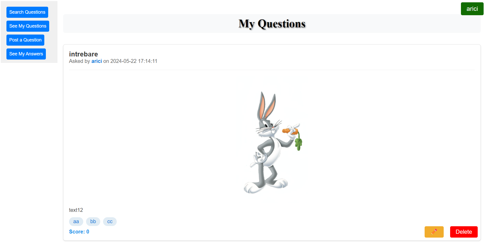
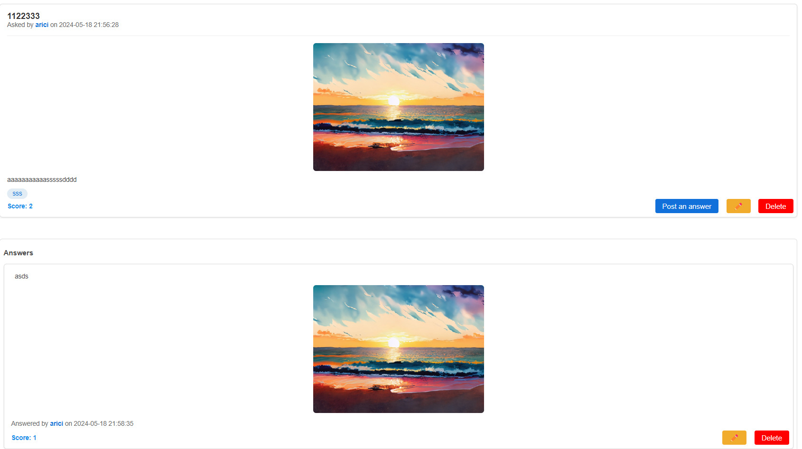
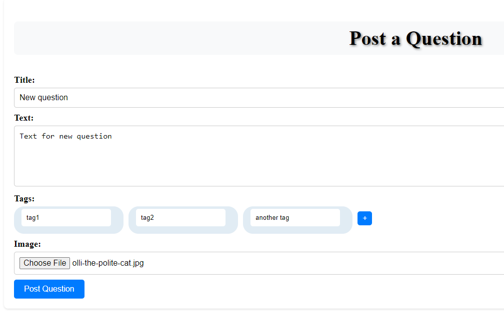
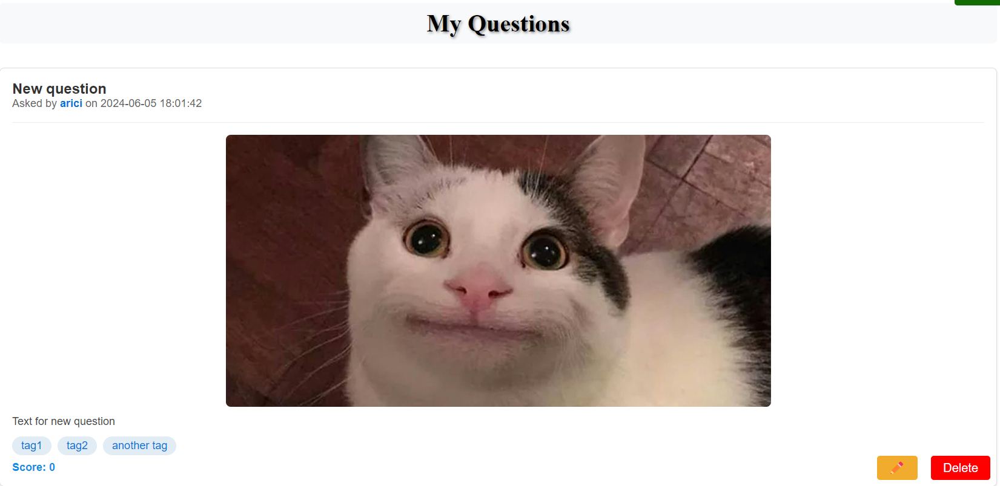
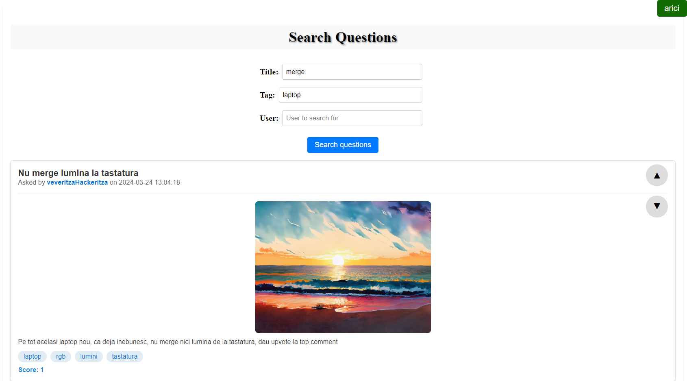
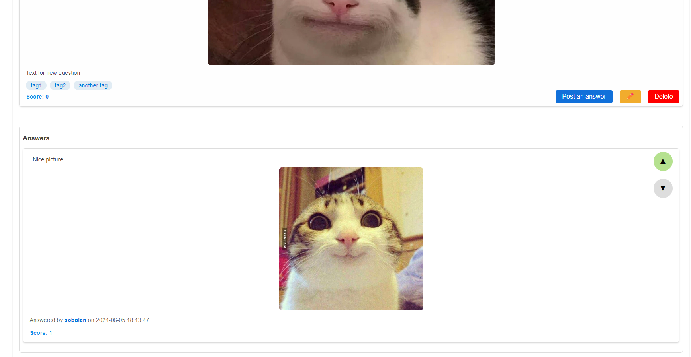
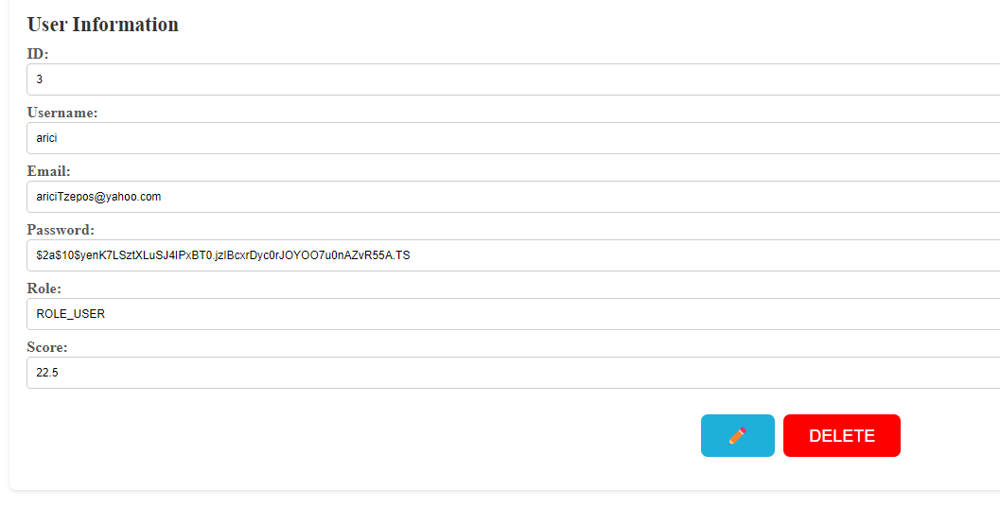
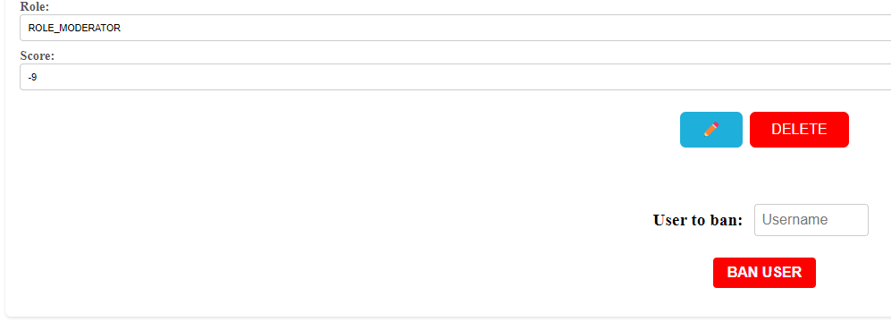

# StackOverflow

Full Stack project in my 3rd university year done for the Software Development course.
 
The project had to mimic the StackOverflow website, more detailed requirements can be seen [here](ProjectRequirments.pdf).
 
Done using

<ul>
	<li>Spring Boot</li>
	<li>React Native</li>
	<li>MySQL Server</li>
</ul>

The project uses JWT tokens for security.
 

## The website

When the user enters on the website it is redirected to the login page.
 

 
 
If he does not have an account he can go the register page and create one.
 
Upon successful login the user is presented with the main page of the app. By default he can see his posted questions.
 
In the top left part the main menu is presented where the user can

<ul>
	<li>Search questions</li>
	<li>See his questions</li>
	<li>Post a new question</li>
	<li>See his answers</li>
</ul>
 

 
 
By clicking on a question the user can post an answer to that question and see the answers posted to that question.
 
If the user is the author it also has access to edit and delete buttons.
 

 
 

When editing a question or an answer the UI is very simple.

 
 

To post a new question the user must input the title and text for the question, optionally it can add as many tags as he wants and an image.

 
And is redirected to "My questions page"
 

 
 

To search for questions the user can filter them by one or more of the following:

<ul>
	<li>Title</li>
	<li>Tag</li>
	<li>User</li>
</ul>
 
We can see that if the question's or answer's author is different than the user, the user has the ability to up-vote or down-vote the question or answer, resulting in a change of score in that answer or question and even on the author or the user depending on the action.
 
All the questions are sorted decreasingly by posting time and all the answers are sorted decreasingly based on score and if equal based on posting time.
 

 
 

A user cannot up-vote or down-vote a question or answer multiple times but can change his vote.

 
 

If the user presses the button on the top right which contains his username he is redirected to the User Information page where he can see information about his account, yes even his bcrypt password hash. He can also edit or delete his account.

 
 

If a user has the moderator role he can delete any answer of question and also ban users in dedicated area in the user information page.
 
The banned user cannot do any action and also receives an e-mail which says that he is banned.

